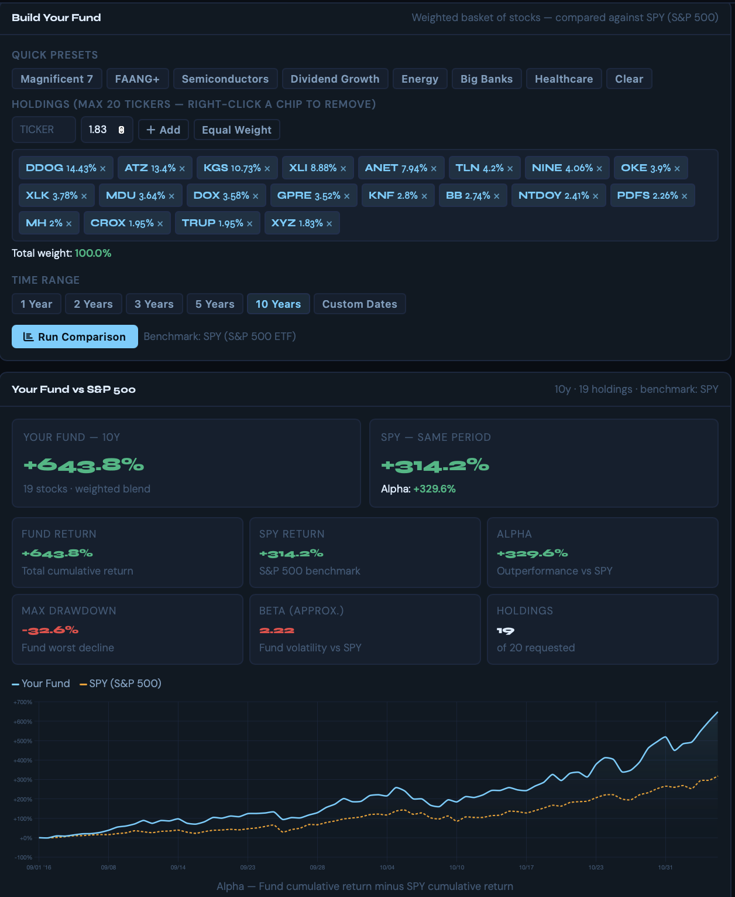
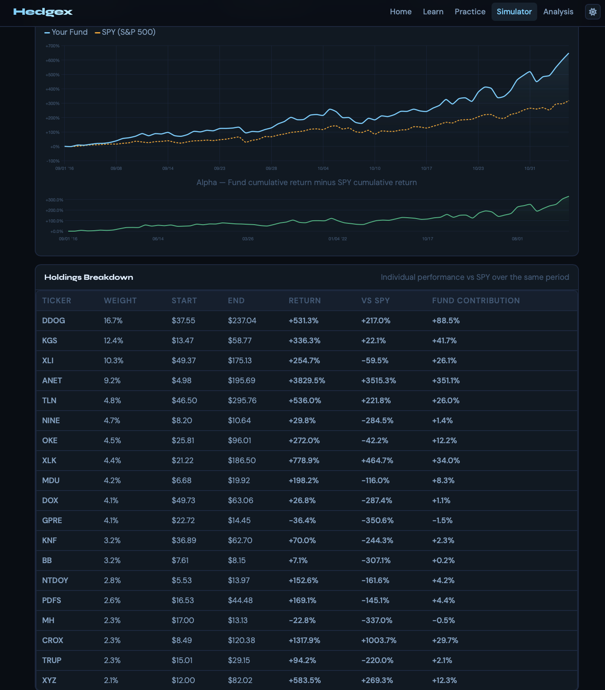

# What I Learned from Analyzing USIT's Portfolio with HedgeX

I used HedgeX to study USIT's portfolio as shown in these screenshots. My goal was to go beyond the headline return and understand what the result says about benchmark-relative performance, downside risk, market sensitivity, position sizing, and concentration. HedgeX let me compare USIT's portfolio with the SPDR S&P 500 ETF (`SPY`) and then trace the overall result back to individual holdings.

> **Scope of my analysis.** I treat the holdings and weights visible in the screenshots as a snapshot of USIT's portfolio for this analysis; I am not assuming that they represent USIT's current live allocations. The results are historical, sensitive to the selected dates and weights, and do not include taxes, fees, slippage, or trading constraints. “Alpha” in this interface is arithmetic outperformance, not regression-based or CAPM alpha. This is an analytical interpretation, not an investment recommendation.

## Portfolio setup and headline results

The USIT portfolio snapshot contained 20 weighted holdings totaling 100%. HedgeX found sufficient history for 19 of them and compared the available basket with `SPY` over the same 10-year period. In this snapshot:

The controls at the top define the experiment. **Quick Presets** load example baskets; **Holdings** lists each requested ticker and target weight; **Equal Weight** divides the allocation evenly; **Total weight** confirms whether the allocations form a complete 100% portfolio; **Time Range** sets the historical window; and **Run Comparison** applies those choices against the displayed benchmark. A ticker chip is an intended position, not proof that the security was ultimately included—data validation happens when the comparison runs.

| Statistic | Snapshot | What it means |
|---|---:|---|
| Fund return | **+643.8%** | If I hypothetically invested $1 at the beginning, it became about $7.44 before costs. This is total cumulative return, not an annual return. |
| SPY return | **+314.2%** | The same $1 benchmark investment became about $4.14 over the same dates. |
| Alpha | **+329.6 percentage points** | HedgeX subtracts SPY's cumulative return from the fund's cumulative return: `643.8% − 314.2%`. This measures arithmetic outperformance in this view. |
| Maximum drawdown | **−32.6%** | The largest peak-to-trough decline in the simulation of USIT's portfolio. An investor would have had to tolerate roughly one-third of the portfolio value disappearing before recovery. |
| Approximate beta | **2.22** | An estimate of sensitivity to SPY. If calculated conventionally from periodic returns, a 1% SPY move is associated with an average fund move of about 2.22% in the same direction. It is not a forecast and can change over time. |
| Holdings analyzed | **19 of 20 requested** | At least one requested ticker did not have usable data across the selected window, so HedgeX excluded it from the comparison. |

### The math behind the summary

For each asset, I calculate cumulative return from its beginning and ending values:

$$
R = \frac{P_{end}}{P_{start}} - 1
$$

The fund's `+643.8%` means its ending wealth multiple is:

$$
1 + R_{fund} = 1 + 6.438 = 7.438
$$

So a hypothetical `$1,000` investment would become approximately:

$$
\$1{,}000 \times 7.438 = \$7{,}438
$$

The same `$1,000` invested in SPY would become:

$$
\$1{,}000 \times (1 + 3.142) = \$4{,}142
$$

I calculate the dashboard's displayed alpha as an arithmetic return spread:

$$
\alpha_{displayed} = R_{fund} - R_{SPY}
= 643.8\% - 314.2\%
= 329.6\text{ percentage points}
$$

Another way I can describe the outcome is terminal wealth: the simulated fund ended with about `7.438 / 4.142 = 1.80×` as much wealth as the SPY investment. If I treat the screenshot as exactly ten years, the approximate compound annual growth rates are:

$$
CAGR_{fund} = 7.438^{1/10} - 1 \approx 22.22\%
$$

$$
CAGR_{SPY} = 4.142^{1/10} - 1 \approx 15.27\%
$$

That is an approximate annualized difference of `6.95` percentage points. I would use the exact number of elapsed days for a production calculation.

### How to read the charts

- **Blue line — Your Fund:** the interface's label for the simulated cumulative growth of USIT's portfolio from a common 0% starting point.
- **Orange dotted line — SPY:** cumulative growth of the S&P 500 benchmark over exactly the same period.
- **Green alpha line:** the point-in-time gap between those two cumulative-return series. A rising line means the fund is extending its lead; a falling line means SPY is catching up, even if both investments are rising.

One distinction I learned to make is the difference between percentage points and percent. The displayed `+329.6%` alpha is a **329.6-percentage-point spread** between two cumulative returns. It does not mean USIT's portfolio earned 329.6% more on a multiplicative basis, and it is not risk-adjusted alpha.

For maximum drawdown, I compare each simulated value of USIT's portfolio with the highest value observed before it:

$$
Drawdown_t = \frac{V_t}{\max_{s \le t}(V_s)} - 1
$$

$$
Max\ Drawdown = \min_t(Drawdown_t)
$$

The displayed `−32.6%` therefore represents the worst peak-to-trough loss in the path, not the fund's worst single-day return.

If I estimate beta conventionally from periodic fund and SPY returns, the calculation is:

$$
\beta = \frac{Cov(r_{fund}, r_{SPY})}{Var(r_{SPY})}
$$

A beta of `2.22` means the fitted relationship is roughly `2.22%` of fund movement for each `1%` SPY movement, on average and before accounting for estimation error. It measures market sensitivity, not guaranteed future movement.

## Holding-level attribution

I use the holdings table to explain where the simulated result for USIT's portfolio came from:

| Column | Interpretation |
|---|---|
| Ticker | Exchange symbol for the security. |
| Weight | The holding's share of the **analyzed USIT portfolio snapshot**. When a requested ticker lacks data, HedgeX rescales the remaining weights to total approximately 100%; small differences can remain because of display rounding. |
| Start / End | The price observations used at the two endpoints. These support a true total-return comparison only if the underlying series is adjusted for splits and distributions; that implementation detail should be disclosed. |
| Return | The holding's cumulative return between the endpoints: `(end / start − 1) × 100`. |
| vs SPY | The holding's return minus SPY's `314.2%` return, expressed in percentage points. For example, DDOG's `531.3% − 314.2% = 217.1` percentage points. |
| Fund contribution | The holding's displayed weight in USIT's portfolio multiplied by its return. For DDOG, roughly `16.7% × 531.3% ≈ 88.5` percentage points. Summing the holdings' contributions produces the simulated portfolio's cumulative return, subject to rounding. |

The setup screenshot shows DDOG at 14.43%, while the analyzed table shows 16.7%. The numbers indicate that ATZ—the 13.4% requested position—was excluded and the remaining holdings were renormalized. I calculate the new DDOG weight as:

$$
w_{DDOG,new} = \frac{14.43\%}{100\% - 13.40\%}
= \frac{14.43\%}{86.60\%}
\approx 16.66\%
$$

That rounds to the displayed `16.7%`. Insufficient full-period history is a likely reason for ATZ's exclusion, but I would want the interface to report the exact cause. The rescaling is useful, but it also means the analyzed version of USIT's portfolio is not identical to the 20-holding snapshot originally entered.

## What I learned from the visualization

### 1. The selected backtest shows large—but highly concentrated—outperformance

The simulation of USIT's portfolio beat SPY by 329.6 percentage points in the selected window. However, ANET contributed approximately **351.1 percentage points**. I calculated its share of USIT's simulated portfolio return as:

$$
\frac{351.1}{643.8} \times 100 \approx 54.5\%
$$

The five largest contributors—ANET, DDOG, KGS, XLK, and CROX—contributed:

$$
351.1 + 88.5 + 41.7 + 34.0 + 29.7 = 545.0
$$

$$
\frac{545.0}{643.8} \times 100 \approx 84.7\%
$$

This means five of the 19 analyzed stocks generated about 84.7% of USIT's simulated cumulative portfolio return.

Under the dashboard's contribution convention, removing ANET's contribution leaves:

$$
643.8\% - 351.1\% = 292.7\%
$$

$$
292.7\% - 314.2\% = -21.5\text{ percentage points versus SPY}
$$

My central conclusion is therefore not simply “USIT's portfolio generates alpha.” What I learned is more specific: **a small number of exceptional winners generated nearly all of the observed edge.** That result is consistent with successful security selection in this backtest, but it does not by itself establish repeatability and it highlights concentration risk.

### 2. Higher return came with materially higher market exposure

The approximate beta of 2.22 and maximum drawdown of −32.6% show me that the headline return was not free. The analyzed simulation of USIT's portfolio behaved like an aggressive equity basket and experienced meaningful losses along the way. The cumulative-alpha chart also contracts during several intervals, indicating that its relative performance was regime-dependent rather than uniformly positive.

### 3. Benchmark-relative performance and portfolio contribution answer different questions

`vs SPY` tells me whether an individual stock outperformed the benchmark. `Fund contribution` tells me how much that stock moved the simulation of USIT's portfolio after accounting for its weight. For holding `i`, I use:

$$
Contribution_i = w_i \times R_i
$$

For DDOG, the displayed values give:

$$
0.167 \times 531.3\% \approx 88.7\text{ percentage points}
$$

The small difference from the displayed `88.5%` comes from using rounded weight and return values. A spectacular stock with a tiny weight may matter less than a moderate winner with a large weight. Putting both views together helps me separate **security selection** from **position sizing**.

### 4. Data availability changes the investment being tested

Because HedgeX analyzed only 19 of the 20 holdings in the USIT snapshot, it reweighted the surviving positions upward. This avoids leaving 13.4% of the model in unexplained cash, but it can introduce survivorship and availability bias. In a research-quality version, I would record which ticker was dropped, why it was dropped, the first common tradable date, and the rebalancing rule applied to USIT's portfolio simulation.

## What I believe this could contribute to QMI

For [QMI](https://usitqmi.com/), I see HedgeX as a practical way to turn a set of holdings into a transparent, testable research discussion. I could contribute it as:

- a **teaching interface** for cumulative return, drawdown, beta, attribution, benchmark choice, and portfolio construction;
- a **research workbench** where analysts can turn a stock thesis into a reproducible benchmark-relative test;
- a **model-audit exercise** for detecting look-ahead bias, survivorship bias, missing-history effects, and overconcentration; and
- a **communication layer** that converts return series into visuals an investment audience can interrogate.

The strongest next quantitative extensions would be CAGR, annualized volatility, Sharpe and Sortino ratios, tracking error, information ratio, rolling beta, sector/factor exposures, turnover, and confidence intervals. Building those features would help me contribute to QMI's work by separating raw excess return from risk-adjusted and statistically credible performance.

## What I believe this could contribute to USIT as a whole

For [USIT](https://www.texasusit.org/usit-foundation), I would use HedgeX as a bridge between fundamental investment reasoning and quantitative portfolio review—not as a stand-alone stock picker:

1. **Before a pitch:** compare a proposed security with SPY and its sector benchmark over multiple market regimes.
2. **During portfolio construction:** show how a new position changes concentration, beta, drawdown, and contribution risk.
3. **At investment committee:** pair the fundamental thesis with a consistent quantitative evidence page.
4. **After investment:** attribute realized performance to selection and sizing instead of judging only the total return.
5. **Across sector teams:** use one shared methodology, making pitches and postmortems easier to compare.

The most meaningful output I would bring to USIT is not the `+643.8%` headline by itself. The value is the ability to ask better portfolio questions: **Was the result diversified? Was it worth the risk? Which thesis actually drove the outcome? Would the conclusion survive a different start date, benchmark, or rebalancing rule?** With HedgeX, I can make those questions visible and give analysts a foundation for answering them systematically.

## Methodology and responsible-use notes

Before I treat a result as investible evidence, I should disclose:

- whether prices are adjusted for splits and dividends;
- whether weights are initial, periodically rebalanced, or allowed to drift;
- how missing tickers and IPOs are handled;
- the return frequency used for beta and drawdown;
- whether the selected holdings or weights were chosen with knowledge of future performance;
- transaction costs, taxes, liquidity, and delisting treatment; and
- results across multiple start dates, benchmarks, and out-of-sample periods.

I do not think these limitations reduce HedgeX's usefulness. Instead, they show me what I would need to validate before presenting the result as evidence about the repeatable performance of USIT's portfolio.

---

*Screenshots captured September 1, 2026. Figures may differ when market data, dates, holdings, or calculation methods change. This document is for educational and research purposes, not investment advice.*
